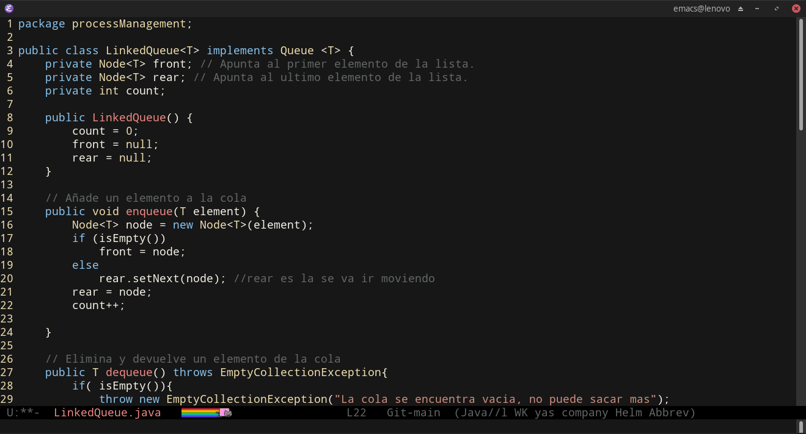

# Turing theme
Tema para emacs, el nombre es en honor al Científico de la Computación [Alan Turing](https://en.wikipedia.org/wiki/Alan_Turing).

Algunas de sus principales aportaciones a la computación teórica y a la inteligencia artificial fueron la **máquina de Turing, la computabilidad universal o el test de Turing**. Bajo los servicios de inteligencia británicos, y a lo largo de la Segunda Guerra Mundial, trabajó en Bletchley Park, el centro de criptografía británico, donde dirigió durante un tiempo el Hut 8, la sección responsable del criptoanálisis naval alemán. Desarrolló unas cuantas técnicas para romper los códigos alemanes, incluida la "bomba", una máquina electromecánica que podía romper el código de la máquina alemana de criptografía Enigma. Fue el primer científico que usó ordenadores con aplicaciones a la matemática.

## Settings
Clonar el repositorio en tu carpeta de themes y agregar en tu init.el
~~~
(add-to-list 'custom-theme-load-path "~/.emacs.d/initFileEmacs/myThemes/Turing-theme")
(load-theme 'turing t)
~~~

### Articulos
<https://www.cultura.gob.ar/alan-turing-el-padre-de-la-inteligencia-artificial-9162/>

<https://en.wikipedia.org/wiki/Alonzo_Church>

<https://www.fib.upc.edu/alan-turing-2012-barcelona/es.html>

